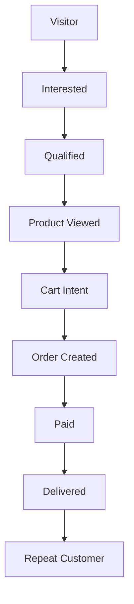

# Closely AI - Product Requirements Document (PRD)

## 1. Product Vision & Outcomes
Closely AI is an AI-powered conversational sales employee built specifically for clothing brands and retail boutiques. Rather than functioning as a general-purpose customer support chatbot, Closely AI is designed around a singular, high-impact outcome: **guiding the customer through a high-conversion sales playbook to purchase apparel on WhatsApp.**

### Key Business Metrics (KPIs):
- **Conversion Rate (Conversation to Order)**: Optimization of the funnel from initial greeting to completed purchase.
- **Response Latency**: Core text interactions under 1.5 seconds.
- **Human Handback Rate**: Escalate high-value negotiations or complex requests, preserving human agent focus for high-value sales.
- **Revenue Influenced**: Direct attribution of sales driven or recovered by the AI.

---

## 2. Customer Journey & Sales Funnel Stages
The product tracks and guides every customer through a unified, 9-stage retail commerce funnel:

| Stage | Trigger Criteria / Event | AI Sales Objective |
| :--- | :--- | :--- |
| **1. Visitor** | First message sent to the WhatsApp number. | Greeting, brand introduction, sizing discovery. |
| **2. Interested** | Expresses intent for a category or fabric (e.g., "Show me sarees"). | Catalog search, surface popular items, profile gender/style. |
| **3. Qualified** | Provides sizing, budget preference, or color preference. | Filter recommendations, match with high-score styles. |
| **4. Product Viewed** | Requests details/media for a specific SKU. | Share images/videos, highlight fabric, stitch quality, color. |
| **5. Cart Intent** | Asks to buy, add to cart, or asks: "How do I pay?". | Formulate cart, confirm size, prompt delivery location. |
| **6. Order Created** | Invoice generated, payment link sent. | Prompt payment, handle payment objections, set urgency. |
| **7. Paid** | Webhook confirms payment receipt from gateway. | Send receipt, explain shipping timeline, thank customer. |
| **8. Delivered** | Logistics API marks order as delivered. | Request fit feedback, handle returns/exchanges. |
| **9. Repeat Customer** | Returns after >7 days to browse again. | Access preference profiles, recommend personalized new drops. |

---

## 3. Lead Scoring Engine
Every customer conversation is scored in real-time across multiple parameters to enable smart automated campaigns, custom styling priority, and timely human takeovers:

- **Purchase Probability (0.0 - 1.0)**: Calculated based on conversion stage, frequency of product views, and cart intent actions.
- **Interest Score (0-100)**: Level of interaction, catalog queries, and media requests.
- **Budget Tier**: Categorized as `Budget`, `Mid-Range`, or `Premium` based on explicit price filters and product catalog interaction history.
- **Urgency (Low/Medium/High)**: Expressed customer timeline (e.g., "Need this before next Friday for a wedding").
- **Sentiment (Positive/Neutral/Negative)**: Customer sentiment derived from message syntax and emojis.

---

## 4. Deterministic AI Guardrails
To protect the brand and minimize hallucination, the system enforces strict deterministic logic:
1. **Price Missing**: If a product has a missing price in the database, the AI *never* makes up a price. It triggers a human takeover or says, *"Let me get the exact pricing from our store manager."*
2. **Out of Stock**: If `stock_count` is 0, the AI *never* promises availability. It says, *"This specific item is currently out of stock due to high demand. Would you like me to show you similar alternatives, or notify you when it's back?"*
3. **Delivery Unknown**: The AI *never* guarantees delivery times if the shipping policy or location is unknown. It requests the pin code and maps it to the delivery matrix.
4. **Policy Missing**: For queries not covered by policies (e.g., custom tailoring requests), the AI immediately escalates to a human.

---

## 5. Competitive Moat & Apparel Specialization
Unlike generic AI tools (OpenAI, Meta), Closely AI is architected specifically for apparel commerce:
- **Fashion-Specific Taxonomy**: Recognizes localized clothing terms (e.g., *Kurti, Banarasi, Anarkali, Zari border, Georgette, Chanderi, Ikat*).
- **Interactive Styling Rules**: Matches products based on styling guidelines (e.g., complementing color matching, blouse recommendations for sarees).
- **Preference Profiling**: Stores historical sizing (e.g., "Size M in Kurtas") and fabric preferences (e.g., "Only organic cotton") to hyper-personalize future chats.
