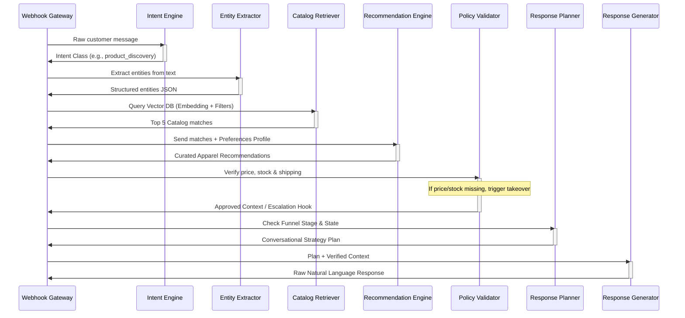

# Closely AI - AI Architecture Specifications

## 1. Pipeline Execution Flow
The AI pipeline is designed to be highly modular, converting freeform customer input into structured database queries, executing compliance checks, planning the conversion strategy, and formatting output payloads.

---

## 2. Pipeline Phase Details & Interfaces

### Phase 1: Context & Intent Parsing (Synchronous)
- **Intent Engine**: Parses text and historical messages to resolve conversational context.
  - *Input*: `{"message": "Do you have M size?", "history": [...]}`
  - *Output*: `{"intent": "availability"}`
- **Entity Extractor**: Extracts specific variables.
  - *Input*: `{"message": "Blue silk saree under 5000"}`
  - *Output*: `{"color": "blue", "fabric": "silk", "category": "saree", "max_price": 5000}`

### Phase 2: Knowledge Retrieval (Parallelized)
- Runs `Catalog Retriever` (using embeddings and SQL constraints for `color` or `max_price`) and `Knowledge Retriever` (looking up shipping and policies) concurrently to save 300ms–500ms of API overhead.
  - *Catalog Query*: `SELECT * FROM products WHERE color = :color AND price <= :max_price ORDER BY embedding <=> :embedding LIMIT 5;`

### Phase 3: Validation & Filtering (Deterministic)
- **Policy Validator**: Compares recommendations against safety rules.
  - *Action*: If `product.stock_count` is `0`, drops the product from the recommendations context list to ensure it's not pitched.
- **Grounding Checker**: Checks the response output.
  - *Action*: Asserts that every price and color listed in the final draft exists *exactly* in the catalog array.

### Phase 4: Strategy & Generation
- **Response Planner**: Evaluates state transitions (e.g., if the user has viewed the product, next prompt: *"Would you like me to book your size?"*).
- **Response Generator**: Assembles the prompt using system rules, context, and funnel objectives.
  - *System Prompt Key*: Injecting Hinglish/local script settings.

---

## 3. Latency & Performance SLA
To keep conversations feeling immediate and responsive on WhatsApp, the backend targets a **total response latency of < 2.0 seconds** under peak load:

1. **Caching Layer (Redis)**: Cache vector embeddings for common queries (e.g., "blue saree") to skip the Gemini embedding generation API call.
2. **API Parallelization**: Execute Entity Extraction and Vector Search embeddings concurrently.
3. **Model Selection**: Use `gemini-2.5-flash` for high-speed, cost-effective NLU tasks and generation.
