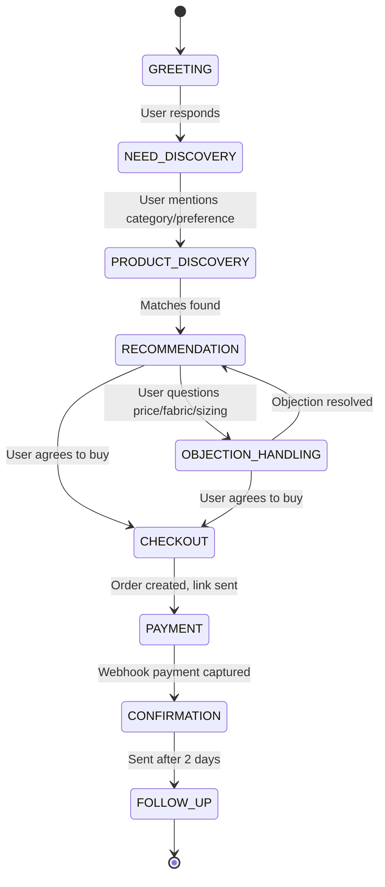

# Closely AI - Conversation Flows & State Machine

## 1. Conversational State Machine
To optimize sales conversions, Closely AI tracks and updates the customer's state machine context in the `conversations` table. Every message triggers an evaluation of state transitions:

---

## 2. State Transition Protocols

| Current State | Target State | Transition Trigger | AI Output Action / Template |
| :--- | :--- | :--- | :--- |
| **GREETING** | **NEED_DISCOVERY** | Customer sends any greeting. | Introduce brand + ask: *"Are you shopping for a specific occasion today (e.g. festive, casual, wedding)?"* |
| **NEED_DISCOVERY** | **PRODUCT_DISCOVERY** | Customer specifies preferences (e.g., "Looking for a summer dress"). | Query catalog + show available categories or top matches. |
| **PRODUCT_DISCOVERY** | **RECOMMENDATION** | Vector matches loaded successfully. | Present 3 matching items with price, material, and image/video URLs. |
| **RECOMMENDATION** | **OBJECTION_HANDLING** | Customer asks: *"Is it pure cotton?"* or *"Is the price negotiable?"* | Grounded response from product attributes or shipping policy. |
| **RECOMMENDATION** | **CHECKOUT** | Customer says: *"I want to buy the green one in size M."* | Gather shipping name, delivery address, and phone number. |
| **CHECKOUT** | **PAYMENT** | Order created in Database. | Generate checkout link via Razorpay/Stripe webhook. Send link. |
| **PAYMENT** | **CONFIRMATION** | Webhook payment status changes to `PAID`. | Send receipt confirmation + packing message. |
| **CONFIRMATION** | **FOLLOW_UP** | Scheduler triggers after 48 hours. | Send automated post-purchase survey: *"How did the M size fit you?"* |

---

## 3. WhatsApp Interactive UI Mapping
For brands using Meta Cloud API directly, Closely AI leverages rich interactive payloads instead of plain text to lower interface friction:

### List Messages (Categories Selection)
- *Trigger*: Customer enters `NEED_DISCOVERY`.
- *UI Element*: A pop-up list displaying: `Sarees`, `Kurtis`, `Lehengas`, `Co-ord Sets`.

### Multi-Product Messages (MPM)
- *Trigger*: Customer enters `RECOMMENDATION`.
- *UI Element*: A WhatsApp Catalog carousel allowing the user to tap individual items to view prices, images, and description.

### Quick Reply Buttons (Checkout)
- *Trigger*: Customer asks about payment methods.
- *UI Element*: Quick replies: `[Pay Now (Online)]` and `[Cash on Delivery (COD)]`.
