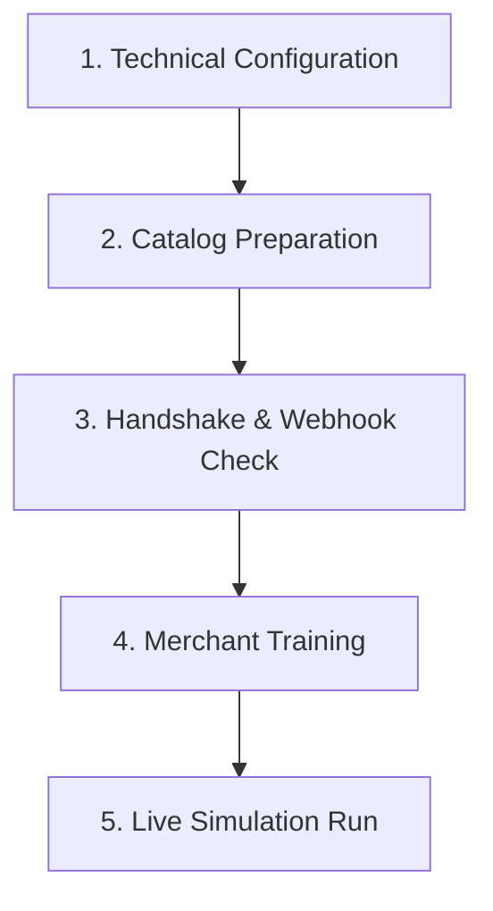

# Closely AI - Pilot Execution Guide & MVP Architecture Freeze

This document serves as the operational guide for executing the Closely AI live pilot and details the formal engineering architecture freeze rules for the MVP. It standardizes the pilot pipeline to ensure consistency, quality, and a clear path toward commercial conversion.

---

## 1. MVP Architecture Freeze Declaration

The engineering architecture of Closely AI is officially **frozen for the MVP**. This freeze ensures that resources are directed exclusively toward real-world customer validation rather than feature creep or preemptive engineering optimization.

### Freeze Rules
* **No Database Schema Changes**: No new tables, columns, or structural alterations unless a blocking bug in a merchant's active workflow demands it.
* **No New AI Modules**: No addition of new LLM pipelines, prompt modules, or agent components. The current processing flow (Intent Engine → Entity Extractor → Retrieval Validator → Recommendation Ranker → Response Generator) is final.
* **No New Architectural Abstractions**: No refactoring of services, introduction of wrapper layers, or new utility frameworks without explicit operational justification.
* **Observation-Driven Development**: All development in Sprint 8 must be driven strictly by observed customer behavior and logged bugs.

---

## 2. Sprint Backlog & Milestones Redefinition

### Sprint 7: Customer Validation Sprint
* **Objectives**:
  1. Complete live WhatsApp connection to the Meta Cloud API.
  2. Onboard one real pilot merchant.
  3. Prepare and import a production-ready merchant catalog.
  4. Process a minimum of 100 real customer conversations.
  5. Gather structured merchant feedback and interviews.
  6. Measure and record business and operational KPIs.
  7. Generate a comprehensive pilot evaluation report.
* **Deliverables**:
  - `pilot/merchant_real_01/catalog.csv` (The imported production catalog)
  - `pilot/merchant_real_01/conversation_logs/` (JSON exports of all 100+ conversations)
  - `pilot/merchant_real_01/metrics.json` (Calculated pilot KPIs)
  - `pilot/merchant_real_01/evaluation.md` (Pilot scorecard and outcomes)
  - `pilot/merchant_real_01/merchant_interview.md` (Pre/Post pilot interview logs)
  - `pilot/merchant_real_01/improvement_backlog.md` (Observed feedback logged for future implementation)

### Sprint 8: Issue Resolution & Hardening
* **Objectives**:
  1. Fix critical stability, usability, and correctness issues discovered during the Sprint 7 pilot.
  2. Run zero new feature work.
  3. Validate hotfixes against the existing regression test suite.

---

## 3. Merchant Onboarding Checklist

The onboarding sequence must be completed sequentially for any new merchant entering the pilot.



| Phase | Task Description | Verification Criteria |
| :--- | :--- | :--- |
| **1. Setup** | Register organization and owner user in the Merchant Console database. | Entry exists in `organizations` and `users` tables. JWT login succeeds. |
| **2. BSP Credentials** | Configure WhatsApp Business Phone Number, Meta Phone Number ID, App Secret, and Permanent Access Token. | Verification ping to `GET /api/health` shows active credentials. |
| **3. Webhooks** | Configure Meta Cloud API webhook URL and Verify Token in the Meta App Dashboard. | Webhook handshake returns `200 OK` and echoes challenge parameter. |
| **4. Catalog** | Upload validated CSV catalog file containing products, stock counts, and image links. | Validation returns `"status": "success"`; pgvector embeddings generated. |
| **5. Testing** | Perform end-to-end smoke test using the WhatsApp sandbox line. | Status updates received via Server-Sent Events (SSE) stream in dashboard. |

---

## 4. Catalog Preparation Requirements

Merchants must format their catalog according to the following strict guidelines before uploading to prevent validation pipeline rejections.

### CSV Catalog Specifications
* **Headers (Case-Sensitive)**: `sku`, `name`, `price`, `color`, `category`, `fabric`, `sizes`, `stock_count`, `image_urls`.
* **Field Constraints**:
  - `sku`: Unique string without spaces (e.g., `SKU-DRS-001`).
  - `price`: Clean positive decimal value (e.g., `1999.00`). No currency symbols (`₹`, `$`).
  - `fabric`: Cannot be empty. Must list core materials (e.g., `100% Linen`, `Georgette`) to enable accurate fabric-based semantic filtering.
  - `sizes`: Comma-separated list of values (e.g., `S,M,L,XL`).
  - `stock_count`: Integer value `>= 0`. Out-of-stock items will be filtered out by the retrieval system.
  - `image_urls`: Comma-separated list of active, secure URLs (`https://`).

### Preparation Steps for Merchants
1. **Catalog Export**: Export the active stock list from POS (Shopify, WooCommerce, etc.) to CSV.
2. **Schema Mapping**: Map headers to the Closely AI required headers.
3. **Data Scrubbing**: Remove currency strings, ensure sizing is uniform, and populate missing fabric details.
4. **Link Check**: Verify that all image URLs are public and load correctly in a web browser.
5. **Dry Run**: Run the CSV file through a local validation script before importing it into the live dashboard database.

---

## 5. Success Metrics & Performance KPIs

We track pilot performance across three isolated segments to ensure overall system reliability and business readiness.

### A. Operational Metrics (System Performance)
* **Average API Latency**: Target `< 1.5s` for end-to-end message generation (excluding Meta API transmission).
* **LLM Response Time**: Average duration of Gemini 2.5 Flash API calls (target `< 1.2s`).
* **Webhook Reliability Rate**: percentage of webhooks successfully responded to with `200 OK` (target `99.9%`).
* **Database Connection Pool Saturation**: Active vs. idle connections (target `< 75%` peak pool size).
* **Token Usage Tracking**: Total prompt/response tokens consumed per conversation.

### B. Business Metrics (Retail & Conversion)
* **Sales Funnel Conversion Rate**: Ratio of customer interactions moving from `product_discovery` → `checkout` → `payment_completed`.
* **Revenue Influenced**: Total sum of sales generated through conversations handled or initiated by the AI assistant.
* **Catalog Match Rate**: Percentage of queries where the vector search successfully retrieves contextually correct products.
* **Cart Abandonment Rate**: Percentage of users who generate a checkout link but do not complete the payment webhook trigger within 30 minutes.

### C. AI Quality Metrics (Safety & Accuracy)
* **AI Containment Rate**: Percentage of conversations resolved entirely by the AI without manual human agent takeover.
* **Human Takeover Rate**: Percentage of conversations requiring human takeover.
* **Intent Classification Accuracy**: Ratio of correctly classified message intents (verified against goldens).
* **Entity Extraction Recall**: Percentage of correct sizes, budgets, and fabrics successfully parsed.
* **Hallucination Log Rate**: Number of responses containing facts or product details not present in the ingested catalog database.
* **Policy Violations Blocked**: Count of generated responses flagged and blocked by the outbound safety validator.

---

## 6. Pilot Interview Questions

Feedback interviews must be conducted with the merchant at two separate intervals to capture qualitative friction.

### Pre-Pilot Interview (Onboarding Assessment)
1. What are the top 3 questions your support agents answer manually on WhatsApp daily?
2. How do you currently handle catalog inquiries when a customer asks for specific colors, fabrics, or budgets?
3. How long does it currently take to send a customer a payment link and close a sale?
4. What is your biggest concern regarding giving an AI system direct access to message your customers?

### Post-Pilot Interview (Value Assessment)
1. Did the AI recommendations match the quality you or your staff would have recommended? (Rate 1-10)
2. How easy was it for your staff to monitor conversations and take over when a customer asked for manual negotiation?
3. Did you notice any situations where the AI made up facts, got confused, or quoted incorrect pricing?
4. If this system saved you `X` hours and generated `Y` in revenue, what monthly subscription fee or revenue-share percentage would you consider fair?
5. Would you recommend Closely AI to other boutique/retail merchants? (NPS Score 0-10)

---

## 7. Daily Monitoring Routine

During the active pilot, the engineering and support team must execute the following daily operational routine to catch and resolve issues immediately.

```
08:30 AM: Morning Health Scan (API & Health Check)
   │
12:00 PM: Mid-Day Review (Check Handover logs & SSE stream)
   │
05:00 PM: Peak-Hour Audit (Monitor latency and error rates)
   │
09:00 PM: End-of-Day Backup & Log Export (Export replay logs)
```

1. **Morning Health Scan (08:30 AM)**:
   - Check `GET /api/health` output.
   - Verify server logs for any unhandled exceptions or connection timeouts during the night.
   - Confirm Celery background worker queues are active and processing.
2. **Mid-Day Conversation Audit (12:00 PM)**:
   - Sample at least 5 active conversations from the dashboard inbox.
   - Review AI messages for tone, relevance, and formatting.
   - Inspect logged handovers to verify that the system correctly triggered takeover on `human_negotiation` intent.
3. **Peak-Hour Latency Monitoring (05:00 PM)**:
   - Check real-time API latency statistics in Prometheus/Grafana or structured logs.
   - Verify that Gemini API rate limits are not being approached.
4. **End-of-Day Replay & Database Backup (09:00 PM)**:
   - Trigger the database backup procedure.
   - Export conversation replay files for all completed chats to local storage.
   - Update the daily pilot scorecard tracker with total message counts and containment rates.

---

## 8. Issue Triage Process (Sprint 8 Matrix)

Issues identified during the pilot must be logged immediately and prioritized according to the following matrix. Under the architecture freeze rules, only P0 and P1 issues are candidates for codebase modifications.

| Priority | Classification | Impact & Examples | Resolution Target |
| :--- | :--- | :--- | :--- |
| **P0** | Critical Blockers | * Breaks core checkout flow, exposes security vulnerabilities (e.g. data leaks across tenants), or triggers system crashes. *Example*: Database connection pool exhaustion under concurrency. | Fix and deploy immediately (within 2 hours). |
| **P1** | Onboarding & Sales | * Prevents a merchant from uploading catalogs or blocks customers from initiating orders. *Example*: Schema validator rejects valid CSV files due to line-ending format. | Resolve within 12 hours. |
| **P2** | Usability / Minor AI | * Frequently reported usability issues or moderate intent confusion that does not block sales. *Example*: AI repeats recommendations or formats price incorrectly in messages. | Add to next daily maintenance release. |
| **P3** | Enhancements | * Aesthetic adjustments, dashboard visual polish, or non-blocking suggestions. *Example*: Adding additional filtering charts to the analytics page. | Defer to Post-Beta Roadmap. |

---

## 9. Exit & Conversion Criteria

### Pilot Exit Criteria
A merchant pilot is considered successfully completed when:
1. **Quantity Gate**: The system has processed at least **100 complete customer conversations** on the live line.
2. **Stability Gate**: Zero unhandled exceptions or service crashes logged over 5 consecutive days of operations.
3. **Safety Gate**: Zero database tenant leaks, zero out-of-stock products recommended, and zero policy compliance violations logged.
4. **Containment Gate**: Maintain an AI containment rate of at least **70%** (i.e. less than 30% of conversations required emergency takeover due to errors or confusion, excluding explicit buyer-requested human negotiations).
5. **Data Gate**: All pilot deliverables (`catalog.csv`, `metrics.json`, `evaluation.md`, `merchant_interview.md`, `conversation_logs/`) are successfully archived in the pilot directory.

### Paying Customer Conversion Criteria
A merchant is prepared for conversion to a paid contract when:
* **Value Demonstrated**:
  - Saved the merchant at least **15 hours** of manual message typing per week.
  - Influenced sales revenue that exceeds the projected cost of the tool by at least `3x`.
* **Satisfaction Validation**: The merchant rates the tool's helpfulness at `8/10` or higher and answers "Yes" to "Would you pay for this product?".
* **Contract Trigger**: The pilot team presents the pricing plans (Subscription or Commission-on-Sale) and secures a signed service agreement.

---

## 10. Post-Pilot Roadmap: Closely AI V2 Features

The following items are deferred to the V2 release cycle post-pilot, protecting the MVP architecture freeze.

### 1. Richer Recommendation Feedback Engine
We will transition from a binary thumbs-up/down schema to a multi-dimensional feedback model:
* **Overall Rating**: 1-to-5 star rating.
* **Categorical Correctness Checklist**:
  - `Correct Product`
  - `Correct Budget`
  - `Correct Color`
  - `Correct Fabric`
  - `Correct Style`
  - `Correct Size`
* **Interaction Action Triggers**:
  - `Customer Purchased`
  - `Merchant Modified Recommendation`

### 2. Transaction Outcome Logging
Rather than tracking simple qualitative labels, we will capture concrete transaction outcomes:
* `Customer bought`: The generated payment link was paid.
* `Customer ignored`: Recommendations sent, but no further user response.
* `Customer requested another product`: User requested alternative options.
* `Merchant overrode AI`: Human took over and manually sent a different product.
* `Conversation abandoned`: Session timed out or expired.

### 3. Recommendation Ranker Version 2 Dataset
All logged recommendations and outcomes will write to a unified dataset file:
* File Name: `recommendation_feedback.csv`
* Schema: `message_id`, `sku`, `score`, `reason`, `merchant_action`, `customer_outcome`
* Use Case: This offline training dataset will be used to train and fine-tune a supervised ranker model in future sprints.

### 4. Replay Export Version 2
Supports exporting conversation transcripts in two discrete formats:
* **JSON Format (For Developers)**:
  ```json
  {
    "conversation_id": "...",
    "conversation": "...",
    "intent": "...",
    "entities": {},
    "retrieved_products": [],
    "ranking_scores": [],
    "policy_checks": [],
    "generator_model": "gemini-2.5-flash",
    "model_version": "...",
    "prompt_version": "...",
    "timestamp": "...",
    "latency_ms": 1234
  }
  ```
* **PDF Format (For Merchants & Support Teams)**:
  - Human-readable conversation transcripts.
  - Highlighted AI reasoning blocks.
  - Product recommendations displayed inline.
  - Merchant feedback logs & action metrics.
  - Key Performance Indicators (latency, containment, conversion).

---

## 11. Pilot Evidence Report Template

Upon pilot completion for a merchant, the execution team must compile a standardized validation report using this template:

```markdown
# Closely AI - Pilot Evidence Report: [Merchant Name]

## 1. Executive Summary & Metadata
* **Merchant Name**: [Name of boutique]
* **Pilot Location**: [e.g. Bangalore Boutique / Online]
* **Pilot Duration**: [Start Date] to [End Date]
* **Catalog Database Size**: [Number of SKUs]
* **Total Customers Served**: [Number of unique customers]
* **Total Conversations Processed**: [Total chat sessions]
* **Total Invoices / Orders Generated**: [Count]
* **Setup & Integration Time**: [Duration in minutes]

## 2. Core Operational Metrics
* **AI Containment Rate**: [Calculated %] (Target: >= 70%)
* **Average AI Latency (p95)**: [Duration in ms] (Target: < 2.0s)
* **Webhook Acknowledgment Rate**: [Calculated %] (Target: >= 99%)
* **Catalog Ingestion Success Rate**: [Calculated %] (Target: >= 95%)

## 3. Recommendation Quality & Conversions
* **Recommendation CTR (Click-Through Rate)**: [Calculated %] (Target: >= 10%)
* **AI Acceptance Rate**: [Calculated %] (Target: >= 70%)
* **Merchant Override Rate**: [Calculated %] (Target: < 25%)
* **Recommendation-to-Purchase Conversion**: [Calculated %] (Target: >= 3%)

## 4. Key Failures & Incidents Logged
[List any outages, API timeouts, or CSV parser errors that triggered takeovers]
1. [Incident A - Severity (P0/P1) - Root Cause - Fix Applied]
2. [Incident B - Severity (P0/P1) - Root Cause - Fix Applied]

## 5. Resolved Issues & Regression Tests Added
[Confirm that every bug fixed during the run generated a corresponding regression test and golden file]
* [Bug Fix 1] -> [Regression Test Path] -> [Golden Dataset Path]
* [Bug Fix 2] -> [Regression Test Path] -> [Golden Dataset Path]

## 6. Qualitative Feedback & Exit Decisions
* **Merchant Satisfaction Score**: [Score 0-10]
* **Commercial Intent (Would Merchant Pay?)**: [Yes / No - Details on price tolerance]
* **Decision**: [Go / No-Go for Design Partner phase / Paid conversion]
```

