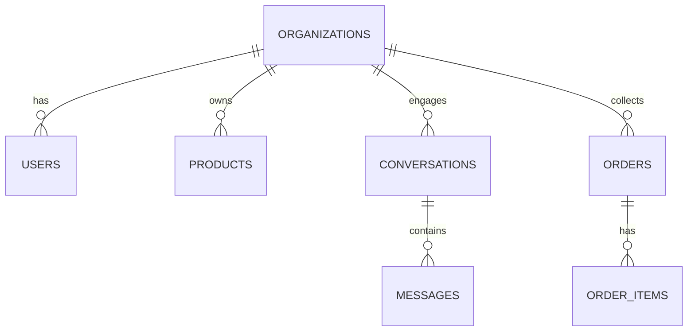
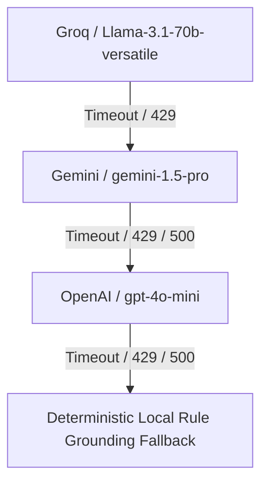

# Closely AI - Current System Architecture

## 1. Database Schema & Multi-Tenant Design
Closely AI uses a single PostgreSQL database with schema-enforced Row-Level Security (RLS) to separate tenants.

### Schema Relationships


### Table Definitions & RLS Policies
1. **organizations**:
   - Fields: `id (UUID)`, `name`, `whatsapp_number`, `whatsapp_phone_number_id`, `whatsapp_business_account_id`, `whatsapp_access_token`, `shipping_policy`, `return_policy`, `discount_limit`.
   - **RLS Policy**: `current_tenant == organization_id OR db.is_admin == True` (allows global read lookup only to administrative tasks like incoming webhook matching).
2. **users**:
   - Fields: `id (UUID)`, `organization_id`, `email`, `hashed_password`, `role (owner/agent)`.
   - **RLS Policy**: Access restricted to logged-in user's `organization_id`.
3. **products**:
   - Fields: `id (UUID)`, `organization_id`, `sku`, `name`, `price`, `stock_count`, `category`, `size`, `color`, `fabric`, `image_url`.
   - **RLS Policy**: Reads/Writes restricted to `organization_id`.
4. **conversations**:
   - Fields: `id (UUID)`, `organization_id`, `customer_phone`, `customer_name`, `status (AI_ACTIVE / WAITING_APPROVAL / HUMAN_AGENT)`.
   - **RLS Policy**: Restricted to `organization_id`.
5. **messages**:
   - Fields: `id (UUID)`, `conversation_id`, `sender (customer / system_ai / agent)`, `content`, `status (delivered / pending_approval)`, `multimedia_url`.
   - **RLS Policy**: Enforced via joining conversation parent table.

---

## 2. Webhook Ingestion Pipeline Flowchart
The following diagram illustrates how an incoming WhatsApp message is verified, authenticated, saved, and processed by the AI in the background:

```mermaid
sequenceDiagram
    autonumber
    actor Customer
    participant Meta as Meta Webhooks
    participant WebhookAPI as Webhooks Router
    participant Queue as Redis Queue (Celery/RQ)
    participant Worker as Async Worker
    participant LLM as LLM Orchestrator
    database DB as Supabase Postgres
    participant SSE as Dashboard (SSE)

    Customer->>Meta: Sends Message
    Meta->>WebhookAPI: POST /api/webhooks/whatsapp (Unauthenticated)
    note over WebhookAPI: Temporarily elevate privileges (SET LOCAL RLS bypass)
    WebhookAPI->>DB: Query Organization by phone_number_id
    DB-->>WebhookAPI: Returns Org (tenant resolved)
    WebhookAPI->>DB: Save Customer Message & Create/Update Conversation
    WebhookAPI->>SSE: Broadcast "new_message" (SSE stream)
    WebhookAPI->>Queue: Enqueue Async Processing Job
    WebhookAPI-->>Meta: Returns 200 OK (Avoids Meta retries)

    note over Worker: Background processing
    Queue->>Worker: Executes job
    Worker->>DB: Fetch last 10 messages for context
    Worker->>Worker: Classify intent and extract entities
    Worker->>DB: Search products and policies
    Worker->>LLM: Generate response prompt (grounded in results)
    LLM-->>Worker: Returns AI Response Draft
    alt Conversation Status is AI_ACTIVE
        Worker->>DB: Save response message as "system_ai"
        Worker->>Meta: POST /messages (dispatch WhatsApp reply)
        Worker->>SSE: Broadcast "new_message" (AI response)
    else Conversation Status is WAITING_APPROVAL
        Worker->>DB: Save response message as "pending_approval"
        Worker->>SSE: Broadcast "draft_proposed" to merchant
    end
```

---

## 3. LLM Orchestrator Fallback Engine
To prevent downtime when external LLM providers fail, the `Orchestrator` implements a hierarchical fallback chain:



1. **Primary Provider (Groq)**: Offers fast response times (< 800ms) suitable for low latency chat.
2. **Secondary Provider (Gemini)**: Leveraged if Groq is overloaded, rate-limited, or fails.
3. **Tertiary Provider (OpenAI)**: Tertiary fallback to ensure high availability.
4. **Offline Rule Grounding**: If all API providers are unreachable, the system automatically falls back to a template-based responder using local product availability metadata (e.g. *"Our Cotton Sarees are available at Rs. 2,500. Let me check with our manager to help you buy."*), bypassing all AI APIs.
