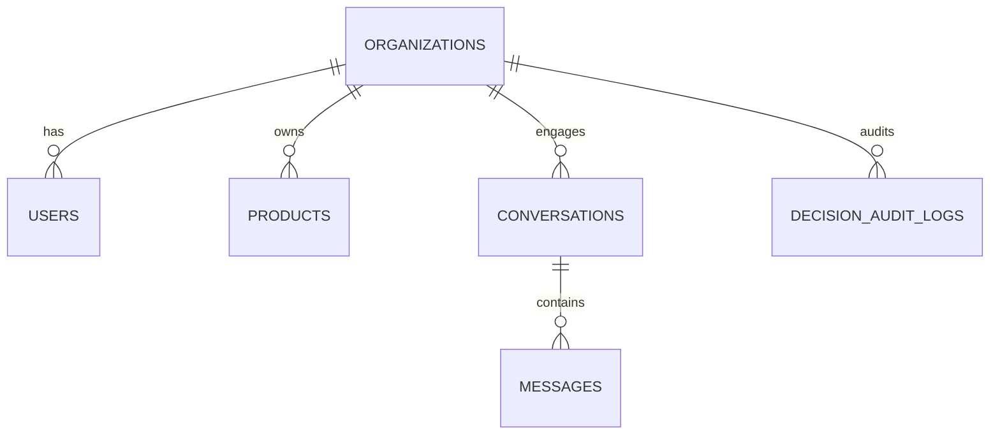
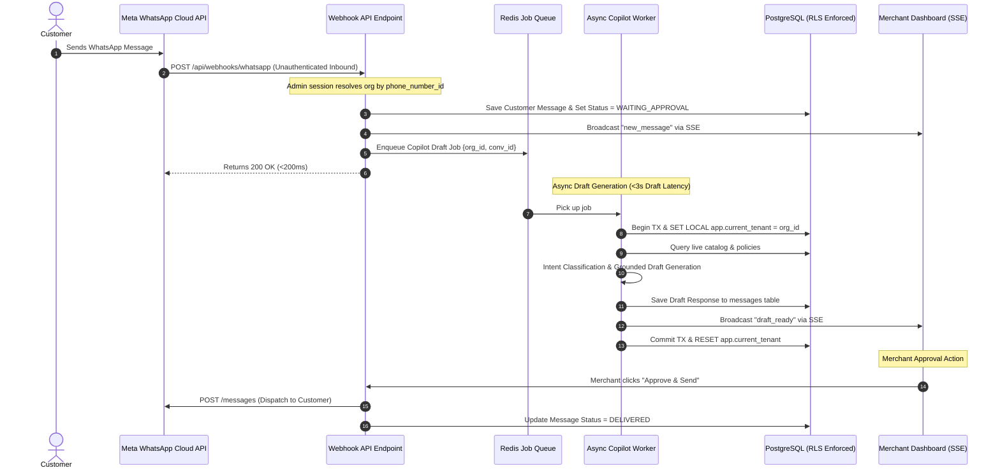

# Closely AI - Current System Architecture & Security Blueprint

> [!IMPORTANT]
> **Security Guardrail**: Tenant isolation is enforced by RLS and verified through concurrency tests and background worker context propagation prior to onboarding merchants.

---

## 1. Multi-Tenant Architecture & Database Schema

Closely AI uses PostgreSQL with schema-enforced Row-Level Security (RLS) to provide multi-tenant data separation.

```
+-----------------------------------------------------------------------------------+
|                                Closely AI Backend                                 |
|                                                                                   |
|  +-----------------------------------+     +-----------------------------------+  |
|  |     Horizontal Core Platform      |     |     Apparel Retail Module (V1)    |  |
|  |                                   |     |                                   |  |
|  |  - Auth & RBAC (Security/JWT)     |     |  - Products & SKUs                |  |
|  |  - Tenant Context Manager (RLS)   |     |  - Stock & Price Snapshots        |  |
|  |  - Webhook Ingestion Router       |     |  - Catalog Hybrid Search          |  |
|  |  - Decision Engine & Guardrails   |     |  - Order Intent Schema            |  |
|  |  - Human Approval Queue & SSE     |     |  - Retail Policy FAQs             |  |
|  |  - Decision Audit Logger          |     |                                   |  |
|  +-----------------------------------+     +-----------------------------------+  |
+-----------------------------------------------------------------------------------+
```

### Table Definitions & RLS Rules



1. **organizations**:
   - Stores tenant configuration, WhatsApp credentials, and merchant policy text.
   - **RLS Rule**: Accessible only when `id == current_setting('app.current_tenant')` or via explicit admin bypass function.
2. **products**:
   - Stores SKUs, names, prices, stock counts, categories, sizes, colors, and fabric details.
   - **RLS Rule**: Enforced by `organization_id == current_setting('app.current_tenant')`.
3. **conversations**:
   - Tracks chat sessions and status (`AI_ACTIVE`, `WAITING_APPROVAL`, `HUMAN_AGENT`).
   - **RLS Rule**: Enforced by `organization_id == current_setting('app.current_tenant')`.
4. **messages**:
   - Stores inbound customer messages and AI/staff drafts.
   - **RLS Rule**: Enforced via parent conversation `organization_id`.
5. **decision_audit_logs**:
   - Append-only audit table logging intent classifications, extracted entities, generated drafts, merchant edits, and approval timestamps.
   - **RLS Rule**: Enforced by `organization_id == current_setting('app.current_tenant')`.

---

## 2. PostgreSQL RLS Security & Background Worker Test Plan

Tenant isolation is enforced by RLS and verified through concurrency tests. The system implements six strict architectural controls:

```
Request / Worker Execution Boundary
      │
      ▼
1. Begin Explicit Database Transaction
      │
      ▼
2. SET LOCAL app.current_tenant = '<validated_org_id>'
      │
      ▼
3. Execute Queries (Postgres RLS blocks cross-tenant access)
      │
      ▼
4. Commit / Rollback Transaction
      │
      ▼
5. RESET app.current_tenant (Prevents connection pool contamination)
```

### Verification Checklist & Test Matrix
1. **Explicit Transaction Scoping**: Every request and worker task opens a transaction block, executes `SET LOCAL app.current_tenant`, and commits/rolls back cleanly.
2. **Connection Pool Cleanup**: On connection return to the pool, `RESET app.current_tenant` is enforced by connection pool middleware.
3. **Background Worker Context Propagation**: Async background jobs (Redis/Celery) receive `organization_id` explicitly in the job payload and set database session context prior to fetching message history.
4. **Audited Admin Paths**: Administrative lookups (e.g. initial webhook matching by `phone_number_id`) execute through a dedicated, audited database session with explicit admin logging.
5. **Concurrent Async RLS Test Suite**:
   - Automated pytest suite spawns 50 concurrent requests representing 5 distinct tenant IDs.
   - Asserts zero cross-tenant reads or writes under heavy async concurrency.
6. **Log Sanitization**: Logs output trace IDs and scrub customer phone numbers, access tokens, and cross-tenant metadata.

---

## 3. Webhook Ingestion & Copilot Draft Pipeline



---

## 4. Pilot Rollback Plan & Incident-Response Procedure

### Pilot Rollback Protocol (Emergency Kill-Switch)
If an unexpected failure or data issue occurs during a live pilot:

1. **Trigger Condition**:
   - Any pricing discrepancy dispatched to a customer.
   - Any cross-tenant data access attempt.
   - Unhandled error rate >5% over 15 minutes.
2. **Execution Steps**:
   - **Step 1 (Silence AI)**: Merchant or administrator clicks **Emergency Disable AI** in settings or executes API kill-switch `POST /api/pilot/killswitch`.
   - **Step 2 (Status Override)**: Database sets all active conversations for the tenant to `HUMAN_AGENT`.
   - **Step 3 (Manual Fallback)**: Merchant staff take over conversations directly via WhatsApp Web or phone handset.
   - **Step 4 (Post-Mortem & Fix)**: Developer team isolates logs using trace IDs, updates test suite with regression cases, and verifies fix before re-enabling copilot.

### Incident Severity Levels
* **SEV-1 (Critical - Immediate Shutdown)**: Cross-tenant data exposure or incorrect price promise dispatched to customer. *Action: Immediate kill-switch activation, root cause analysis.*
* **SEV-2 (High - Fallback to Human Approval)**: Telemetry draft-generation latency >10s or draft service degradation. *Action: Pause auto-draft notifications, rely on staff manual typing.*
* **SEV-3 (Low - Non-Blocking)**: Minor UI dashboard glitch or non-critical metric logging delay. *Action: Resolve in standard patch cycle.*
