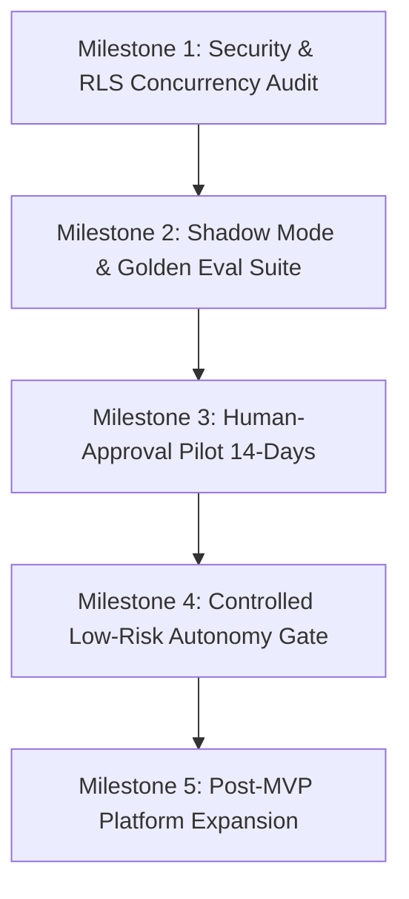

# Closely AI - MVP Roadmap & Progressive Execution Plan

> [!IMPORTANT]
> **Core Objective**: Prove that one apparel boutique will actively use and pay for a verified WhatsApp Catalog-Response Copilot before expanding features or automating further.

---

## 1. Maturity Gates & Operating Phases



---

## 2. Detailed Milestone Breakdown

### Milestone 1: Security, RLS & Multi-Tenant Hardening (Current Priority)
Ensure tenant isolation enforced by RLS and verified through concurrency tests and background worker context isolation.

- [x] **RLS Session Context**: Enforce `SET LOCAL app.current_tenant` on all database transactions.
- [x] **Admin Lookup Isolation**: Separate unauthenticated webhook organization lookup into audited admin helper routines.
- [ ] **Background Worker Context Test**: Add unit tests verifying async background workers receive tenant context explicitly in job payloads.
- [ ] **RLS Async Concurrency Suite**: Execute a 50-thread concurrent request test attempting cross-tenant reads and writes.
- **Verification Gate**: 100% pass rate on multi-tenant RLS concurrency tests. Zero secret leakage in logs.

---

### Milestone 2: Shadow Mode & Baseline Ingestion (Pre-Pilot)
Deploy Closely AI in **Shadow Mode** with proposed pilot merchant *Pushpalatha Silks*.

- [ ] **Catalog Ingestion**: Support CSV / Google Sheet catalog upload (SKU, Name, Price, Stock, Size, Color, Fabric, Image URL).
- [ ] **Baseline Metrics Capture**: Record 7 days of historical manual chat metrics (median response time, inquiry volume, conversion rate).
- [ ] **Shadow Mode Execution**: Ingest live WhatsApp messages, generate copilot drafts in background, compare AI drafts against merchant staff responses without dispatching AI replies to customers.
- **Verification Gate**: Achieve ≥95% intent classification accuracy and 100% price/stock correctness on real pilot message logs (`n=200`).

---

### Milestone 3: 14-Day Human-Approval Live Pilot (Beachhead Validation)
Transition proposed pilot merchant to **Human-Approval Mode**.

- [ ] **Real-Time Draft Notifications**: Alert merchant dashboard on incoming queries with generated copilot drafts (<3s draft-generation latency target).
- [ ] **One-Click Approval Inbox**: Enable staff to review, edit, and click **Approve & Send** to dispatch replies via WhatsApp Cloud API.
- [ ] **Exception Escalation**: Ensure 100% of bargaining, refund, and complaint queries lock in `WAITING_APPROVAL` or `HUMAN_AGENT` status.
- **Verification Gate (Success Criteria H1–H6)**:
  - Median response latency drops from baseline to <60 seconds.
  - Merchant confirms increased qualified order intent capture.
  - Zero incorrect price or stock promises dispatched.
  - Merchant agrees to continue with paid pilot.

---

### Milestone 4: Controlled Low-Risk Autonomy (Post-Pilot)
Enable automated responses ONLY for verified catalog inquiries and standard FAQs.

- [ ] **Low-Risk Auto-Responder**: Auto-send responses ONLY for high-confidence catalog inquiries (`confidence > 0.95`, in-stock items, exact policy matches).
- [ ] **Exception Lock**: Keep bargaining, custom orders, and complaints 100% locked in Human-Approval Mode.
- **Verification Gate**: Zero customer pricing complaints, <1% merchant manual overrides on auto-responded threads.

---

### Milestone 5: Platform Expansion & Additional Verticals (Post-MVP Scope)

```
              ┌──────────────────────────────────────────────┐
              │      Closely AI Core Platform Infrastructure │
              └──────────────────────┬───────────────────────┘
                                     │
       ┌─────────────────────────────┼─────────────────────────────┐
       ▼                             ▼                             ▼
┌──────────────┐             ┌──────────────┐             ┌──────────────────┐
│ Education    │             │ Real Estate  │             │ Future Scope:    │
│ Admissions   │             │ Lead Qual    │             │ Healthcare &     │
│ Module       │             │ Module       │             │ Fintech Modules  │
└──────────────┘             └──────────────┘             └──────────────────┘
```

1. **Education & Admissions**: Course discovery, fee structure FAQs, application qualification, counselor booking.
2. **Real Estate**: Property listing inquiries, buyer budget qualification, site visit scheduling.
3. **Healthcare (Future Scope)**: Clinic service FAQs, appointment requests, staff confirmation. *Subject to formal HIPAA/DISHA compliance implementation, PII encryption, zero unreviewed medical advice.*
4. **Fintech & Banking (Future Scope)**: Account FAQs, eligibility guidance, secure advisor handoff. *Subject to formal KYC/AML/SOC 2 compliance implementation and human credit decision locks.*
