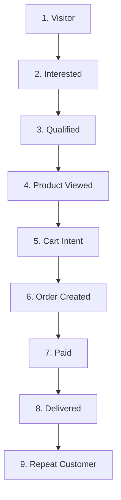

# Closely AI - Product Requirements Document (PRD)

## 1. Customer Funnel Stages & Objectives
Closely AI tracks the customer's state in real-time across a 9-stage retail commerce funnel:



1. **Visitor**: Initial inbound greeting. *Objective*: Greet, explain brand specialties, discover sizing.
2. **Interested**: Browsing intent (e.g., *"Show me sarees"*). *Objective*: Search catalog and display matching items with images.
3. **Qualified**: Prefers specific sizes, color, or budget. *Objective*: Narrow catalog search.
4. **Product Viewed**: Asks details of a specific SKU. *Objective*: Display close-up photos, price, fabric, and availability.
5. **Cart Intent**: Asks to purchase (e.g., *"I want to buy this"*). *Objective*: Confirm size/color, request shipping address, calculate total.
6. **Order Created**: Invoice generated and payment link sent. *Objective*: Follow up, overcome payment objections.
7. **Paid**: Webhook confirms payment. *Objective*: Deliver receipt, outline delivery timeline.
8. **Delivered**: Logistics update. *Objective*: Request fit feedback, handle potential returns/exchanges.
9. **Repeat Customer**: Returning shopper (>7 days). *Objective*: Suggest personalized items from new drops.

---

## 2. NLU Payload Schema
Every incoming message is passed through an intent classifier and entity extractor. The payload is parsed into the following structured JSON schema:

```json
{
  "intent": "product_discovery | product_info | logistics | store_info | availability | discount_inquiry | human_negotiation | refund | complaint",
  "entities": {
    "product_type": "saree | kurti | lehenga | blouse | suit",
    "color": ["red", "blue", "black", "pink"],
    "size": ["S", "M", "L", "XL", "Free Size"],
    "fabric": ["silk", "cotton", "georgette", "linen"],
    "budget_min": 1000.0,
    "budget_max": 5000.0,
    "quantity": 1
  },
  "language": "en | te | hi",
  "script": "latin | telugu | devanagari"
}
```

---

## 3. Deterministic Decision Engine Rulesets
To prevent LLM hallucinations, the **Deterministic Decision Engine** evaluates catalog data and merchant policies. It routes responses according to these strict rules:

### A. Grounding & Honesty Rule
- **Condition**: If the LLM generates a response containing a product price or stock status that does not match the catalog lookup.
- **Action**: Reject response, trigger `GROUNDING_FAILURE`, and send to Human Approval Queue.

### B. Out-of-Stock Rule
- **Condition**: Product `stock_count` is `0` in database.
- **Action**: AI says: *"This item is currently out of stock. Would you like me to show similar alternatives or notify you when it's back?"* (AI never promises delivery of out-of-stock items).

### C. Missing Price Rule
- **Condition**: Product price is missing or set to `0.00` in the database.
- **Action**: Intercept response, tell the customer: *"Let me get the exact pricing from our store manager."*, and route to Human Takeover.

### D. Discount & Bargaining Rule
- **Condition**: Intent is `discount_inquiry` or `human_negotiation`.
- **Action**: Look up organization `discount_limit` policy:
  - If `discount_limit == 0`: Immediately route to Human Approval Queue.
  - If `discount_limit > 0` and request is within limit: Auto-approve with standard policy response.
  - If requested discount exceeds limit: Mark as `HUMAN_NEGOTIATION` and route to Human Takeover.

### E. Refund & Complaint Rule
- **Condition**: Intent is `refund` or `complaint`.
- **Action**:
  - If `refund_requires_owner == True` or intent is `complaint`: Immediately change status to `WAITING_APPROVAL`, notify the merchant, and suspend AI responses.

---

## 4. Merchant Dashboard Interface Specs
The merchant dashboard is partitioned into three functional areas:

### A. Chats Screen
- **Inbox List**: Filtered by status columns: `All`, `AI Active`, `Wait Approval`, and `Human Agent`.
- **Chat Feed**: Color-coded bubbles representing:
  - Blue: Customer messages.
  - Green: Autonomously sent AI responses.
  - Yellow: Proposed AI drafts waiting for approval.
  - Purple: Manually typed merchant agent replies.
- **Takeover Panel**: A toggle button at the top right of the chat feed to switch conversation status between `AI Active` and `Human Agent` (silencing the AI immediately).

### B. Catalog Screen
- **Inventory Table**: Searchable and paginated table listing all SKUs, names, prices, categories, sizes, and stock status.
- **CSV Upload Box**: Drag-and-drop file uploader to bulk ingest and overwrite catalog details. Highlights formatting validation errors (e.g. missing `sku`, `price`, or `name`).

### C. Settings Screen
- **Meta Integration Settings**: Form fields to input Display Phone Number, WABA ID, Phone Number ID, and Access Token, accompanied by a **Test Meta Connection** diagnostic utility.
- **Policy Grounding Panel**: Rich-text textareas to configure shipping, return, and discount rules.
