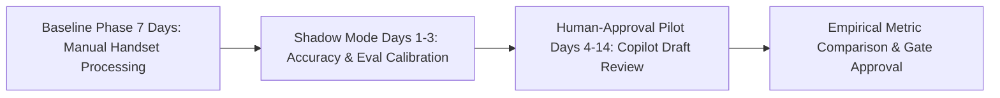
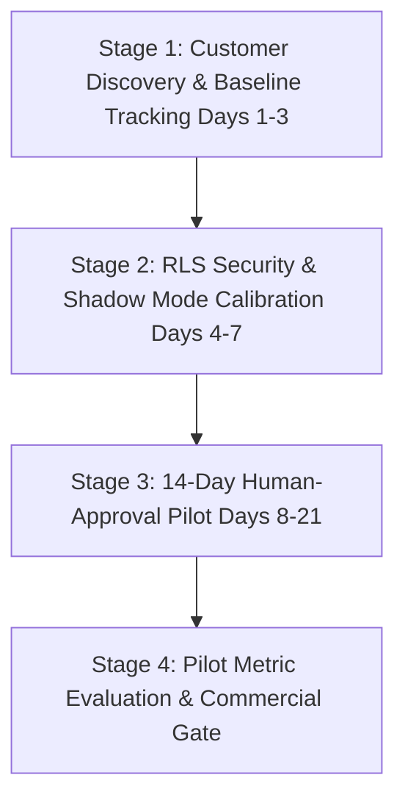

# Closely AI - Product Validation & Verification Plan

> [!IMPORTANT]
> **Core Principle**: Do not confuse a visually impressive prototype with a validated product. Validate through empirical pilot metrics and customer willingness to pay before writing production code.

---

## Part 1: Strategic Validation Hypotheses

Rather than treating assumptions as established facts, Closely AI measures success against six core hypotheses:

* **H1 (Inquiry Volume)**: At least 3 of 5 interviewed boutiques receive 50+ WhatsApp inquiries daily.
* **H2 (Response Latency Impact)**: At least 3 of 5 boutiques report that delayed replies directly cause lost or abandoned sales opportunities.
* **H3 (Response Latency Reduction)**: During the pilot, Closely AI reduces median first-response time from the merchant's manual baseline to below 60 seconds (with human approval).
* **H4 (Deterministic Accuracy)**: In the approved test dataset, Closely AI uses deterministic validation to prevent unsupported price, stock, and policy claims (achieving ≥99% accuracy on applicable queries).
* **H5 (Qualified Intent Capture)**: During the pilot, the merchant confirms that Closely AI increases qualified order intents compared with the baseline period.
* **H6 (Commercial Willingness to Pay)**: At least one merchant agrees to continue with a paid pilot after the 14-day trial.

---

## Part 2: Product Quality & Acceptance Criteria

| Area | Requirement / Target | Verification Method |
|---|---|---|
| **Price Correctness** | **100%** | Deterministic SQL database lookup assertion |
| **Stock Correctness** | **100%** | Live inventory snapshot cross-check |
| **Unsupported Product Claims** | **0** | RAG golden dataset evaluation suite (`n=200`) |
| **Escalation Recall** | **100%** | Automated test suite covering discounts, refunds, and complaints |
| **Intent Classification Accuracy** | **≥95%** | Benchmark test on golden dataset |
| **Draft-Generation Latency (Simple Queries)** | **<3.0 seconds** | Telemetry tracking from webhook arrival to draft ready in dashboard |
| **p95 Latency** | Tracked separately for complex & human-approval flows | System telemetry logs |

---

## Part 3: Baseline vs. Pilot Comparison Framework

To empirically evaluate pilot impact, the 14-day trial tracks explicit before-and-after metrics:

### Metrics Tracked
1. **Response Latency**: Baseline manual response time vs. Copilot draft-assisted response time (median and p95).
2. **Inquiry Volume & Qualified Order Intent**: Total incoming chat leads vs. conversations reaching order intent stage.
3. **Escalation & Intervention Volume**: Number of queries routed to `WAITING_APPROVAL` or `HUMAN_AGENT`.
4. **Draft Accuracy & Rejection Rate**: Number of copilot drafts approved without changes vs. edited/rejected drafts.
5. **Merchant Time Saved**: Weekly hours spent messaging by store staff before vs. during copilot usage.
6. **Customer Feedback & Abandonment Rate**: Number of abandoned chat threads (>1 hour inactivity) and customer complaints.

---

## Part 4: One-Page Actionable Validation Plan

### Stage 1: Customer Discovery & Baseline Tracking (Days 1–3)
* **Goal**: Verify catalog readiness and capture baseline response metrics.
* **Process**: Interview 5 apparel boutique owners in Dharmavaram/Kanchipuram. Analyze 7 days of historical WhatsApp chat logs to measure manual response latency and inquiry volume.
* **Gate Criteria**: At least 3 merchants provide structured catalog data and report response delay bottlenecks.

### Stage 2: RLS Security & Shadow Mode Calibration (Days 4–7)
* **Goal**: Validate RLS concurrency security, worker context propagation, and draft accuracy.
* **Process**: Run 50-thread concurrent RLS security test suite (tenant isolation enforced by RLS and verified through concurrency tests). Execute Closely AI in **Shadow Mode** on live incoming message logs (0 messages sent to customers).
* **Gate Criteria**: 100% RLS test pass rate; zero cross-tenant leaks; ≥95% intent accuracy and 100% price/stock correctness on shadow drafts.

### Stage 3: 14-Day Human-Approval Live Pilot (Days 8–21)
* **Goal**: Execute live copilot pilot with proposed pilot merchant *Pushpalatha Silks*.
* **Process**: Enable dashboard draft notifications (<3s draft-generation latency). Merchant staff review and click **Approve & Send** on generated copilot responses. Bargaining, refunds, and complaints lock 100% in human queue.
* **Gate Criteria**:
  1. Median customer response time drops below 60 seconds.
  2. Qualified order intents increase compared to baseline.
  3. Zero ungrounded pricing or stock claims dispatched to customers.
  4. Merchant agrees to paid pilot continuation.
