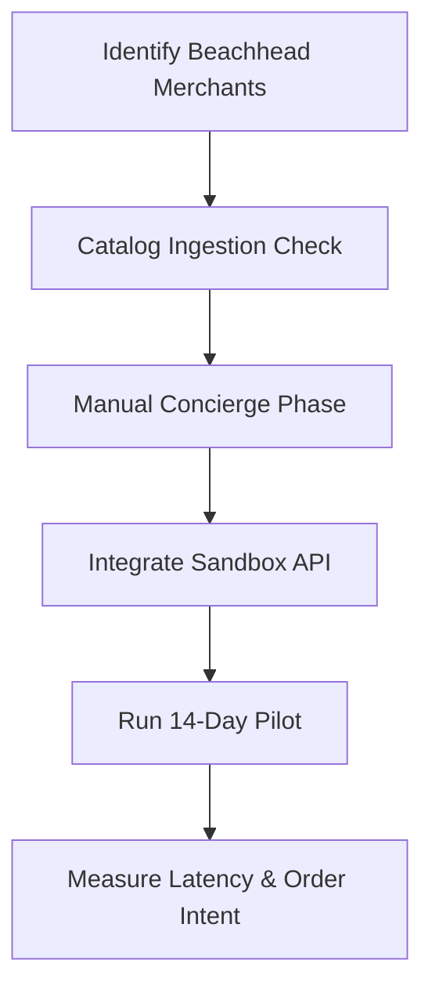

# Closely AI - Product Validation & Verification Plan

## Part 1: Critical Strategic Review

### 1. Three Critical Assumptions Most Likely to be Wrong
1. **Catalog Maintenance Feasibility**: Assuming boutique owners maintain or will regularly update a structured product catalog (CSV/SQL database). In reality, local boutiques have high stock turnover and often track inventory solely via physical inspection and smartphone galleries.
2. **Autonomous Checkout Completion**: Assuming retail customers are comfortable completing high-ticket apparel purchases (e.g., silk sarees costing $50–$300) with a chatbot. Shoppers heavily prioritize human connection, video-call verification of the fabric drape, and personalized trust building.
3. **Dashboard Engagement**: Assuming mobile-first boutique owners will actively log into a separate web-based merchant dashboard to manage queues. If the notification does not arrive on WhatsApp or SMS, the merchant will miss it.

### 2. Feature of Highest Customer Value
* **Instant Conversational Catalog Search & Availability Matching**: Answering the immediate question *"Do you have this saree in stock?"* in under 2 seconds. Preventing lead drop-off during the first 60 seconds of shopper intent has the highest direct correlation to conversion.

### 3. Feature Unnecessary for Version 1 MVP
* **Gemini-powered Multimodal Visual Product Search**: Allowing customers to upload photos of sarees to match catalog SKUs is technically complex and high-risk. MVP discovery can be solved cleanly with text search and categorical filters.

### 4. Riskiest Technical Decision
* **PostgreSQL Session-Scoped Row-Level Security (RLS)**: Setting `SET LOCAL app.current_tenant` on database connection pools. In multi-threaded or async environments, any failure to correctly clear, reset, or set these variables under RLS poses a severe risk of cross-tenant data exposure.

### 5. The "Concierge" Manual Version (Fastest Sell)
* **Human-in-the-Loop Copywriter**: Set up a shared Google Sheet catalog. When a customer messages the merchant, the query is forwarded to the founder (you) via a private Slack channel. You manually look up the sheet, write a grounded draft, and send it to the merchant to copy-paste.

### 6. First Customer Niche to Interview
* **Boutique Silk Saree Retailers in Dharmavaram & Kanchipuram**: Mobile-first, micro-manufacturers who run active Instagram accounts and manage 50–150 inbound sales chats per day on WhatsApp.

### 7. Exact Measurable Result of the MVP
* **Reduce initial response latency from ~4 hours to under 3 seconds**, generating a **minimum 25% increase in captured order intent** during a 14-day customer pilot.

---

## Part 2: One-Page Validation Plan

### Stage 1: Customer Discovery & Manual Validation (Days 1–3)
* **Goal**: Verify if boutique owners can provide a structured list of SKUs and if they will trust an assistant to draft answers.
* **Process**: Interview 5 boutique owners. Have them share their current WhatsApp chat history and their inventory format (photos, diary entries, or spreadsheets).
* **Success Criteria**: At least 3 owners can provide an inventory sheet with prices and are willing to use a helper tool to auto-respond.

### Stage 2: Webhook & AI Grounding Validation (Days 4–7)
* **Goal**: Validate that the RLS context bypass and NLU decision engine reliably route policy exceptions to the human approval queue.
* **Process**: Connect the sandbox phone number to a staging server. Send 50 test messages covering:
  - Valid catalog inquiries.
  - Bargaining queries (e.g. *"Konchem thagginchandi"*).
  - Out-of-stock items.
* **Success Criteria**: 100% of out-of-stock and negotiation queries are intercepted and set to `WAITING_APPROVAL` status; 0% of valid in-stock inquiries fail.

### Stage 3: Live Pilot & Metric Ingestion (Days 8–14)
* **Goal**: Run a live sales assistant pilot with 1 boutique.
* **Process**: Verify the permanent WhatsApp Business API number (after Meta rate-limit lifts) and run Closely AI in `WAITING_APPROVAL` mode (where all responses are drafts waiting for merchant approval before sending).
* **Success Criteria**: 
  - Median merchant response time drops under 30 seconds.
  - Customer order intent increases by >=25% compared to the previous week's manual history.
  - Zero false price promises are dispatched to customers.
